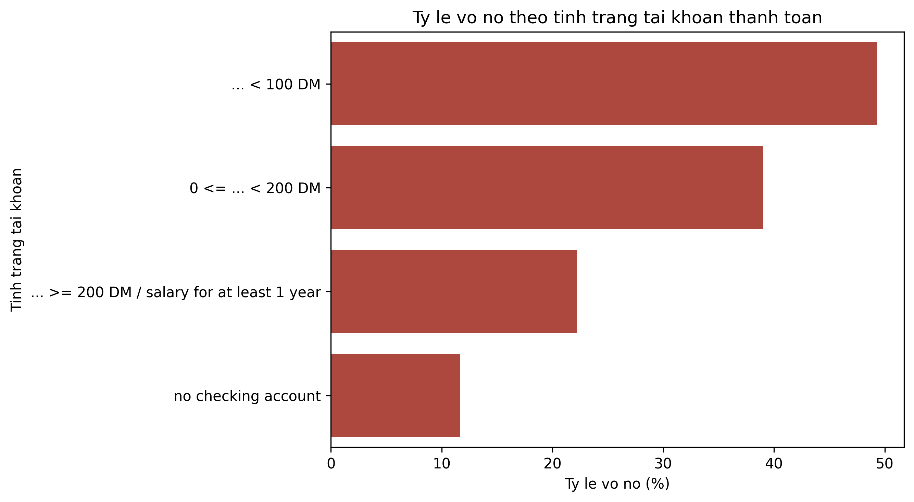
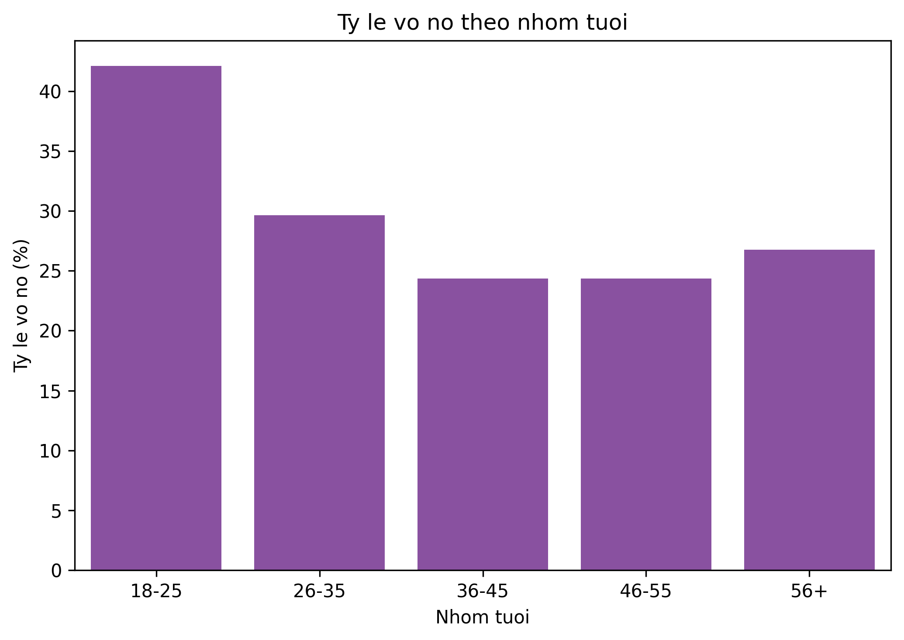
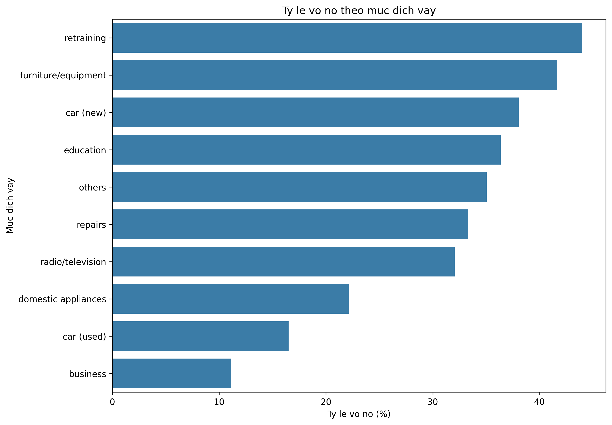
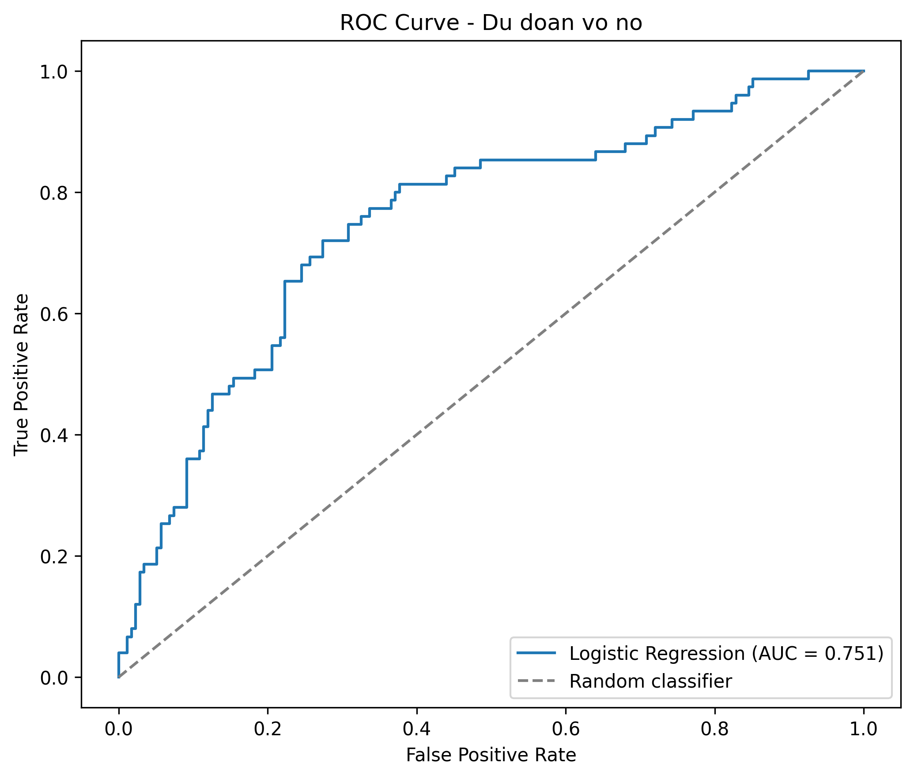
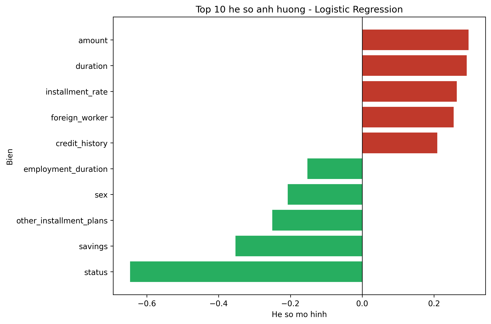
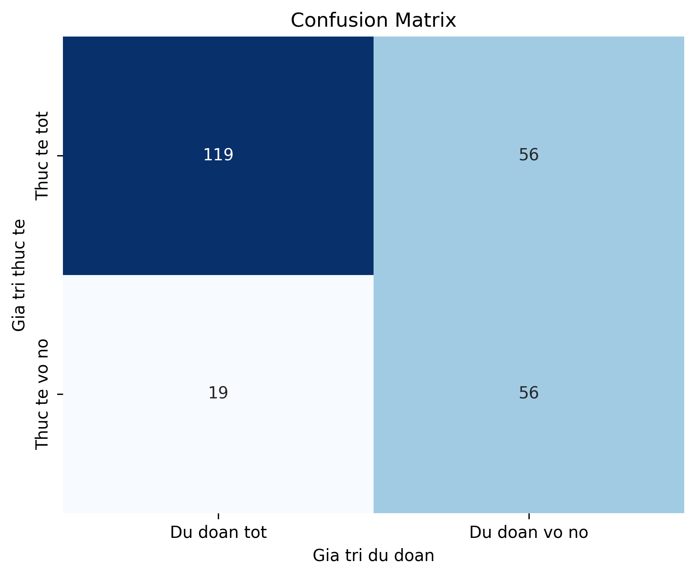

<div align="center">

# Credit Risk Analysis

### Phân tích rủi ro tín dụng và dự đoán nguy cơ vỡ nợ

**Personal Data Analytics Project | Banking Domain**


</div>

## Giới thiệu

Dự án phân tích **1.000 hồ sơ vay tín dụng cá nhân** nhằm xác định những nhóm khách hàng có nguy cơ vỡ nợ cao và xây dựng mô hình hỗ trợ dự đoán rủi ro tín dụng.

Quy trình thực hiện bao gồm làm sạch dữ liệu, tạo đặc trưng, phân tích khám phá dữ liệu, trực quan hóa kết quả và xây dựng mô hình Logistic Regression.

Dự án được thực hiện với mục đích học tập và xây dựng portfolio cho vị trí **Data Analyst Intern**, đặc biệt trong lĩnh vực tài chính – ngân hàng.

> Kết quả của dự án chỉ mang tính chất phân tích và học tập, không được sử dụng như một hệ thống chấm điểm tín dụng thực tế.


## Mục tiêu dự án

* Phân tích đặc điểm của khách hàng vay cá nhân.
* Xác định các nhóm khách hàng có tỷ lệ vỡ nợ cao.
* Tìm hiểu mối liên hệ giữa rủi ro tín dụng và các yếu tố như độ tuổi, mục đích vay, khoản tiết kiệm và tài khoản thanh toán.
* Xây dựng mô hình Logistic Regression để dự đoán xác suất vỡ nợ.
* Đánh giá mô hình bằng các chỉ số như Accuracy, Precision, Recall và ROC-AUC.
* Đề xuất một số khuyến nghị hỗ trợ bộ phận thẩm định tín dụng.


## Nguồn dữ liệu

Dự án sử dụng bộ dữ liệu [German Credit Data](https://archive.ics.uci.edu/dataset/144/statlog+german+credit+data) từ UCI Machine Learning Repository.

Thông tin dữ liệu:

* **Số lượng hồ sơ:** 1.000
* **Số thuộc tính đầu vào:** 20
* **Biến mục tiêu:** `credit_risk`
* **Không có giá trị thiếu**
* **Bài toán:** Phân loại khách hàng có rủi ro tín dụng tốt hoặc xấu

Các nhóm thông tin chính gồm:

* Tình trạng tài khoản thanh toán
* Lịch sử tín dụng
* Mục đích vay
* Số tiền và thời hạn vay
* Mức tiết kiệm
* Thời gian làm việc
* Độ tuổi
* Nhà ở và tài sản
* Nghề nghiệp
* Số khoản tín dụng hiện có


## Quy trình thực hiện

### 1. Làm sạch và chuẩn bị dữ liệu

* Kiểm tra cấu trúc và kiểu dữ liệu.
* Kiểm tra giá trị thiếu.
* Tạo biến `default` để biểu diễn nguy cơ vỡ nợ.
* Chia khách hàng thành các nhóm tuổi.
* Chia số tiền vay thành bốn nhóm theo phân vị.
* Tách thông tin giới tính từ biến trạng thái cá nhân.

### 2. Phân tích khám phá dữ liệu

Phân tích tỷ lệ vỡ nợ theo:

* Nhóm tuổi
* Mục đích vay
* Tình trạng tài khoản thanh toán
* Mức tiết kiệm
* Nghề nghiệp
* Nhà ở
* Giới tính
* Nhóm số tiền vay

### 3. Xây dựng mô hình

* Mã hóa các biến phân loại.
* Chuẩn hóa các biến đầu vào.
* Chia dữ liệu thành tập huấn luyện và tập kiểm tra.
* Sử dụng Logistic Regression với `class_weight='balanced'`.
* Đánh giá mô hình bằng ROC-AUC và Classification Report.


## Kết quả nổi bật

* Tỷ lệ vỡ nợ tổng thể trong bộ dữ liệu là **30%**.
* Nhóm khách hàng từ **18 đến 25 tuổi** có tỷ lệ rủi ro cao hơn các nhóm tuổi còn lại.
* Khách hàng có số dư tài khoản thanh toán thấp có tỷ lệ vỡ nợ cao hơn.
* Mức tiết kiệm và tình trạng tài khoản thanh toán là những tín hiệu đáng chú ý trong quá trình đánh giá rủi ro.
* Một số mục đích vay như đào tạo lại và mua ô tô mới có tỷ lệ rủi ro tương đối cao.
* Mô hình Logistic Regression đạt **ROC-AUC khoảng 0.751**.
* Recall của nhóm vỡ nợ đạt khoảng **75%**, cho thấy mô hình nhận diện được phần lớn hồ sơ rủi ro trong tập kiểm tra.

Các kết quả trên thể hiện mối liên hệ trong bộ dữ liệu và không khẳng định quan hệ nguyên nhân – kết quả.


## Kết quả trực quan

### Tỷ lệ vỡ nợ theo tình trạng tài khoản thanh toán

Khách hàng có số dư tài khoản thanh toán thấp hoặc không ổn định thường có tỷ lệ vỡ nợ cao hơn.



### Tỷ lệ vỡ nợ theo nhóm tuổi

Nhóm khách hàng từ 18 đến 25 tuổi có tỷ lệ rủi ro cao hơn so với các nhóm tuổi lớn hơn.



### Tỷ lệ vỡ nợ theo mục đích vay

Mức độ rủi ro có sự khác biệt giữa các mục đích sử dụng khoản vay.



### Đường cong ROC

ROC Curve được sử dụng để đánh giá khả năng phân biệt giữa khách hàng tốt và khách hàng có nguy cơ vỡ nợ.



### Các yếu tố ảnh hưởng đến dự đoán

Hệ số Logistic Regression thể hiện chiều hướng ảnh hưởng của từng biến đến xác suất dự đoán vỡ nợ.



### Confusion Matrix

Confusion Matrix thể hiện số lượng dự đoán đúng và sai của mô hình trên tập kiểm tra.




## Khuyến nghị nghiệp vụ

Từ kết quả phân tích, bộ phận thẩm định tín dụng có thể cân nhắc:

* Ưu tiên kiểm tra kỹ các hồ sơ có số dư tài khoản thanh toán thấp.
* Kết hợp thông tin tài khoản thanh toán, mức tiết kiệm và lịch sử tín dụng khi đánh giá hồ sơ.
* Thẩm định kỹ hơn các khoản vay có thời hạn dài hoặc giá trị lớn.
* Sử dụng mô hình như một công cụ sàng lọc sơ bộ, không thay thế hoàn toàn đánh giá của chuyên viên.
* Điều chỉnh ngưỡng dự đoán tùy theo chi phí của việc bỏ sót khách hàng có nguy cơ vỡ nợ.
* Tránh sử dụng độ tuổi, giới tính hoặc quốc tịch như tiêu chí quyết định độc lập.


## Công nghệ sử dụng

* **Python**
* **pandas**
* **NumPy**
* **Matplotlib**
* **Seaborn**
* **scikit-learn**
* **Jupyter Notebook**
* **Microsoft Word**


## Cấu trúc repository

```text
Credit-Risk-Analysis/
│
├── GermanCredit.csv
├── analysis.py
├── Credit_Risk_Analysis.ipynb
├── results.json
├── Bao_cao_Phan_tich_Rui_ro_Tin_dung.docx
├── charts/
│   ├── 01_default_rate_by_status.png
│   ├── 02_default_rate_by_age.png
│   ├── 03_default_rate_by_purpose.png
│   ├── 04_roc_curve.png
│   ├── 05_logistic_regression_coefficients.png
│   └── 06_confusion_matrix.png
└── README.md
```

| File/Thư mục                             | Mô tả                                                             |
| ---------------------------------------- | ----------------------------------------------------------------- |
| `GermanCredit.csv`                       | Bộ dữ liệu được sử dụng trong dự án                               |
| `analysis.py`                            | Làm sạch dữ liệu, phân tích EDA, xây dựng mô hình và xuất biểu đồ |
| `Credit_Risk_Analysis.ipynb`             | Notebook trình bày code, kết quả và giải thích                    |
| `results.json`                           | Lưu các chỉ số phân tích và kết quả mô hình                       |
| `Bao_cao_Phan_tich_Rui_ro_Tin_dung.docx` | Báo cáo phân tích dành cho người đọc nghiệp vụ                    |
| `charts/`                                | Thư mục chứa các biểu đồ PNG                                      |


## Hướng dẫn chạy dự án

### 1. Cài đặt thư viện

```bash
pip install pandas numpy scikit-learn matplotlib seaborn jupyter
```

### 2. Chạy file phân tích

```bash
python analysis.py
```

Sau khi chạy, chương trình sẽ:

* Phân tích dữ liệu
* Huấn luyện mô hình Logistic Regression
* Xuất kết quả vào `results.json`
* Tạo thư mục `charts`
* Lưu các biểu đồ dưới định dạng PNG

### 3. Mở Jupyter Notebook

```bash
jupyter notebook Credit_Risk_Analysis.ipynb
```


## Hạn chế của dự án

* Bộ dữ liệu chỉ có 1.000 hồ sơ.
* Dữ liệu được thu thập trong bối cảnh khác với thị trường Việt Nam.
* Mô hình chưa được kiểm định trên dữ liệu tín dụng thực tế mới.
* Một số biến phân loại được mã hóa đơn giản nên vẫn còn khả năng cải thiện.
* Kết quả mô hình có thể thay đổi theo cách chia tập dữ liệu.
* Dự án chưa đánh giá đầy đủ về tính công bằng, pháp lý và khả năng giải thích của mô hình.


## Hướng phát triển

* Thay Label Encoding bằng One-Hot Encoding cho các biến phân loại.
* Thử nghiệm Random Forest, XGBoost hoặc Gradient Boosting.
* Sử dụng Cross-Validation để đánh giá mô hình ổn định hơn.
* Điều chỉnh ngưỡng phân loại để cân bằng Precision và Recall.
* Xây dựng dashboard Power BI.
* Phân tích mức độ công bằng của mô hình theo giới tính và quốc tịch.
* Xây dựng hệ thống chấm điểm rủi ro thử nghiệm.


## Tác giả

**Võ Huỳnh Thủy Tiên**

Sinh viên ngành Khoa học dữ liệu

Định hướng: Data Analyst / Business Analyst

* Email: [vohuynhthuytien1769@gmail.com](mailto:vohuynhthuytien1769@gmail.com)

Cảm ơn bạn đã dành thời gian xem dự án. Mọi góp ý về phương pháp phân tích, mô hình và cách trình bày đều được trân trọng.
